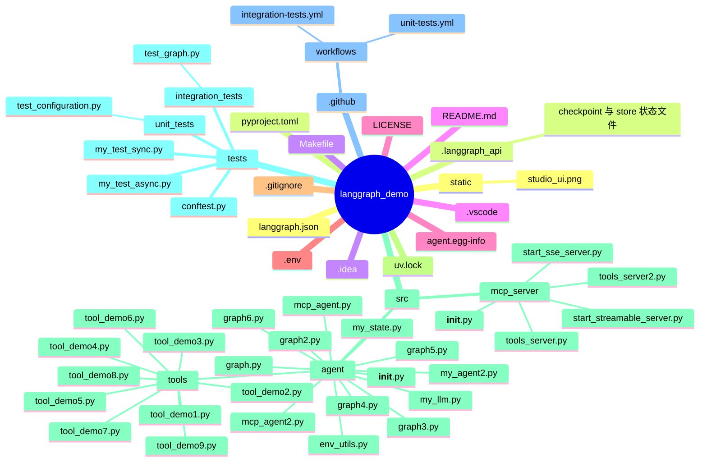
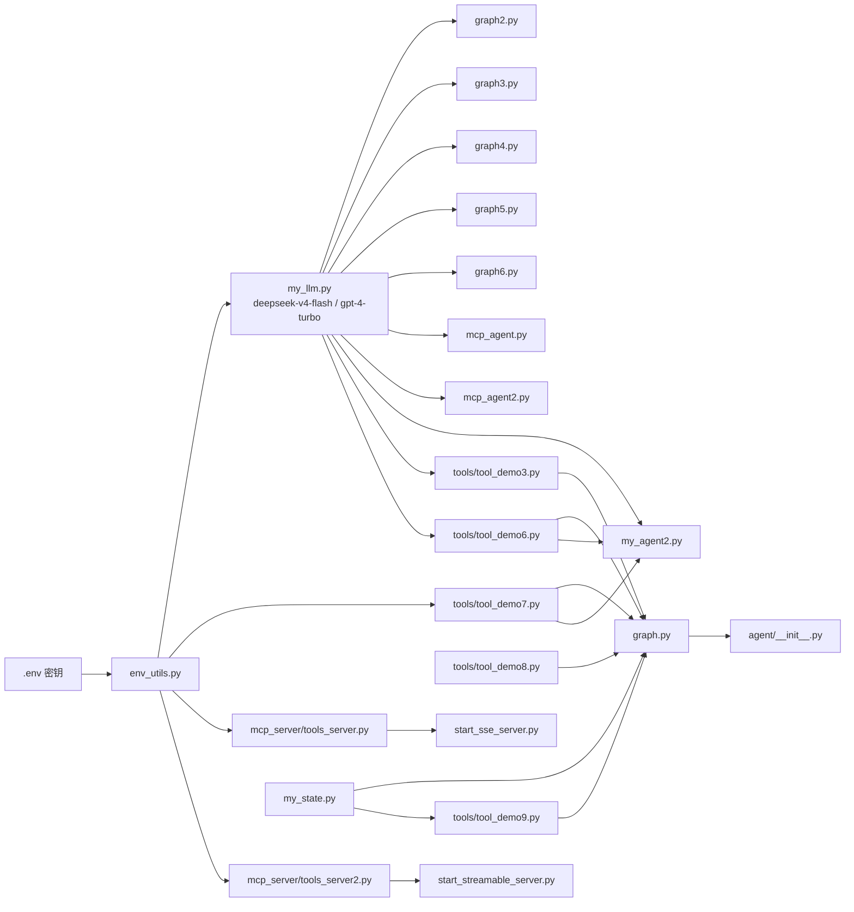
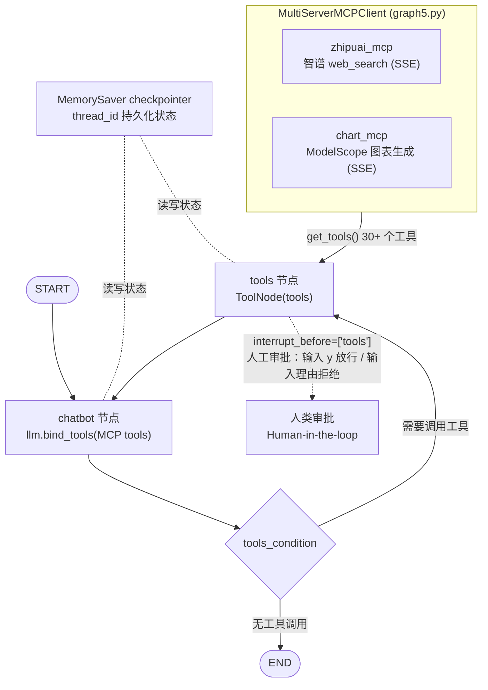

# langgraph_demo 项目结构分析

> 一个基于 [LangGraph](https://github.com/langchain-ai/langgraph) 的智能体项目：
> 注册入口 `langgraph.json` → `src/agent/graph5.py`，通过 MCP 客户端接入智谱 web_search 与 ModelScope 图表服务，
> 同时包含本地 FastMCP 服务器与 9 个自定义工具（demo 用途）。

## 1. 目录结构图（mermaid mindmap）

## 2. 模块依赖图（mermaid flowchart）

## 3. 注册主图 graph5 的运行时架构（mermaid flowchart）

## 4. 各文件职责速查

| 文件 | 职责 |
|---|---|
| `langgraph.json` | LangGraph 服务器配置，注册入口 `agent = src/agent/graph5.py:graph` |
| `src/agent/env_utils.py` | 加载 `.env`，暴露 OPENAI / DEEPSEEK / LOCAL / ZHIPU 密钥 |
| `src/agent/my_llm.py` | LLM 工厂：当前用 deepseek-v4-flash，另有大量本地/云端模型配置（注释） |
| `src/agent/my_state.py` | 自定义状态 `CustomState`（继承 AgentState） |
| `src/agent/graph.py` | `create_react_agent` + 本地工具（demo3/6/7/8/9），模板默认图 |
| `src/agent/graph2.py` | 最简单的 StateGraph：LLM + StrOutputParser 链 |
| `src/agent/graph3.py` | MCP 客户端图 + 自研 `BasicToolsNode`（异步并发执行工具） |
| `src/agent/graph4.py` | MCP 客户端图 + 标准 `ToolNode` / `tools_condition` |
| `src/agent/graph5.py` | **注册主图**：MCP + ToolNode + MemorySaver + `interrupt_before` 人工审批循环 |
| `src/agent/graph6.py` | 进阶版：`BasicToolsNode` + `interrupt`/`Command` + MemorySaver |
| `src/agent/mcp_agent.py` | `create_react_agent` 直接接入 MCP 客户端 |
| `src/agent/mcp_agent2.py` | 同上变体 |
| `src/agent/my_agent2.py` | `create_react_agent` + sqlite/PostgresSaver 持久化 + 本地工具 |
| `src/agent/tools/` | 9 个工具 demo：`@tool`、pydantic 参数、LCEL Runnable 工具、BaseTool 搜索工具、注入工具（InjectedState/InjectedToolCallId/Command） |
| `src/mcp_server/tools_server.py` | FastMCP 服务器「老王的MCP」：搜索工具、打招呼、提示模板、资源 |
| `src/mcp_server/tools_server2.py` | FastMCP + JWT 认证（RSAKeyPair / JWTVerifier / AccessToken） |
| `src/mcp_server/start_sse_server.py` | 以 SSE 方式启动 tools_server |
| `src/mcp_server/start_streamable_server.py` | 以 Streamable HTTP 方式启动 tools_server2 |
| `tests/` | 单元/集成测试 + 手写 sync/async 测试 |
| `.github/workflows/` | CI：unit-tests / integration-tests |
| `.langgraph_api/` | `langgraph dev` 运行产生的 checkpoint / store 状态 |

## 5. 发现的问题（建议关注）

- `langgraph.json` 注册的符号是 `src/agent/graph5.py:graph`，但 `graph5.py` 中只有
  `create_graph()` 异步工厂，**没有模块级变量 `graph`**（`graph` 只是 `run_graph()` 内的局部变量），
  `langgraph dev` 加载该图可能会报错。可改为 `graph5.py:create_graph`，或在模块级补一个
  `graph = asyncio.run(create_graph())`。
- `agent/__init__.py` 导出的是 `agent.graph` 中的图，与 `langgraph.json` 注册的 `graph5` 不一致；
  README 描述的入口（graph.py）也与实际注册（graph5.py）不一致。
